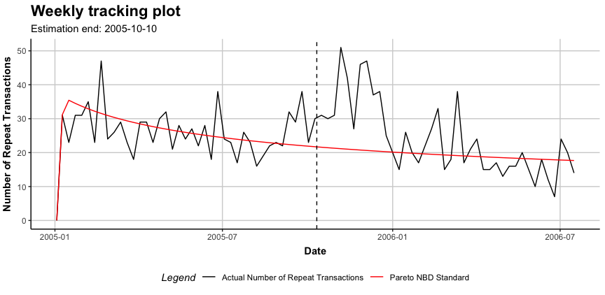

[](https://github.com/bachmannpatrick/CLVTools/actions)
[](https://github.com/bachmannpatrick/CLVTools/actions)
[](https://cran.r-project.org/package=CLVTools)
[](https://www.repostatus.org/#active)
[](https://cran.r-project.org/package=CLVTools)

<!-- README.md is generated from README.Rmd. Please edit that file -->

## The CLVTools Package

Today, customer lifetime value (CLV) is the central metric for valuing
customers. It describes the long-term economic value of customers and
gives managers an idea of how customers will evolve over time. To model
CLVs in continuous non-contractual business settings such as retailers,
probabilistic customer attrition models are the preferred choice in
literature and practice.

The R package **CLVTools** provides an efficient and easy to use
implementation framework for probabilistic customer attrition models in
non-contractual settings. Building up on the learnings of other
implementations, the package adopts S4 classes to allow constructing
rich and rather complex models that nevertheless still are easy to apply
for the end user. The framework is capable to accommodate a variety of
probabilistic customer attrition models for non-contractual settings in
continuous and discrete time.

Currently, CLVTools implements the following probabilistic models:

1)  Standard Pareto/NBD model (Schmittlein, Morrison & Colombo 1987)

2)  Pareto/NBD model with **time-invariant** contextual factors (Fader &
    Hardie 2007)

3)  Pareto/NBD model with **time-varying** contextual factors (Bachmann,
    Meierer & Näf 2020)

4)  Standard BG/NBD model (Fader, Hardie, & Lee 2005)

5)  BG/NBD model with **time-invariant** contextual factors (Fader &
    Hardie 2007)

6)  Standard Gamma/Gompertz/NBD (Bemmaor & Glady 2012)

7)  Gamma/Gompertz/NBD model with **time-invariant** contextual factors
    (Näf, Bachmann & Meierer 2020)

In future versions of **CLVTools** the following models are added. See
[GitHub Issues](https://github.com/bachmannpatrick/CLVTools/projects)
for a time-line.

8)  Standard BG/BB model (Fader, Hardie, & Shang 2010)

9)  Gamma/Gamma model to estimate customer spending (Colombo & Jiang
    1999; Fader, Hardie & Lee 2005; Fader & Hardie 2013)

In addition the framework features a system of layers between the
optimizer and the log-likelihood function to allow the flexible addition
of model extensions during the model fitting process. Currently these
layers include:

  - Correlation of the purchase and the attrition process

  - L2 regularization for parameters of contextual factors

  - Equality constraints between parameters of contextual for the
    purchase and the attrition process.

## Installation Instructions

Install the stable version from CRAN:

    install.packages("CLVTools")

Install the development version from GitHub:

    devtools::install_github("bachmannpatrick/CLVTools", ref = "development")

Note that the package depends on RcppArmadillo and RcppGSL which will
likely require additional setup steps in order to compile and install
the CLVTools package from source.

## A Minimal Example

For detailed instructions and all available options and model variations
see the [Walkthrough](https://www.clvtools.com/articles/CLVTools.html)
and the [manual](https://www.clvtools.com/reference/index.html).

Start by loading the package:

``` r
library("CLVTools")
```

As Input data `CLVTools` requires customers’ transaction history. Every
transaction record consists of a purchase date and customer ID.

``` r
data("apparelTrans")
apparelTrans
#>         Id       Date  Price
#>    1:    1 2005-01-03  26.95
#>    2:   10 2005-01-03  38.95
#>    3:   10 2005-02-25  93.73
#>    4:   10 2005-04-05 224.96
#>    5:  100 2005-01-03 104.95
#>   ---                       
#> 2349: 1221 2006-01-23  62.95
#> 2350: 1221 2006-03-09  89.95
#> 2351: 1221 2006-05-14  52.95
#> 2352: 1222 2005-01-03   5.90
#> 2353: 1222 2005-03-03  13.90
```

Before we estimate a model, we are required to initialize a data object
using the `clvdata()` command. The data object contains the prepared
transactional data and is later used as input for model fitting.
Additionally we specify options for the date and time units, estimation
duration and variable names (see
[Walkthrough](https://www.clvtools.com/articles/CLVTools.html) for
details). Make sure to store the generated object in a variable, e.g. in
our example `clv.apparel`.

``` r
clv.apparel <- clvdata(apparelTrans,  
                       date.format="ymd", 
                       time.unit = "week",
                       estimation.split = 40,
                       name.id = "Id",
                       name.date = "Date",
                       name.price = "Price")
```

To estimate the first probabilistic latent attrition model we start with
the standard Pareto/NBD model and therefore use the command `pnbd()` to
fit the model and estimate model parameters. Other models such as the
BG/NBD model (`bgnbd()`) and the GGomp/NBD (`ggomnbd()`) are available.

``` r
est.pnbd <- pnbd(clv.data = clv.apparel)
#> Starting estimation...
#> Estimation finished!
est.pnbd
#> Pareto NBD Standard  Model
#> 
#> Call:
#> pnbd(clv.data = clv.apparel)
#> 
#> Coefficients:
#>       r    alpha        s     beta  
#>  0.7867   5.3356   0.3574  11.6316  
#> KKT1: TRUE 
#> KKT2: TRUE 
#> 
#> Used Options:
#> Correlation:     FALSE
```

You can always use `summary()` to get details on CLVTools object (also
before they are estimated):

``` r
#Full detailed summary of the parameter estimates
summary(est.pnbd)
#> Pareto NBD Standard  Model 
#> 
#> Call:
#> pnbd(clv.data = clv.apparel)
#> 
#> Fitting period:                               
#> Estimation start  2005-01-03   
#> Estimation end    2005-10-10   
#> Estimation length 40.0000 Weeks
#> 
#> Coefficients:
#>       Estimate Std. Error z-val Pr(>|z|)    
#> r       0.7867     0.1324 5.942 2.82e-09 ***
#> alpha   5.3356     0.9028 5.910 3.42e-09 ***
#> s       0.3574     0.1841 1.941   0.0523 .  
#> beta   11.6316    10.6823 1.089   0.2762    
#> ---
#> Signif. codes:  0 '***' 0.001 '**' 0.01 '*' 0.05 '.' 0.1 ' ' 1
#> 
#> Optimization info:                 
#> LL     -2879.4699
#> AIC    5766.9399 
#> BIC    5781.0257 
#> KKT 1  TRUE      
#> KKT 2  TRUE      
#> fevals 20.0000   
#> Method L-BFGS-B  
#> 
#> Used Options:                 
#> Correlation FALSE
```

Once the model parameters are estimated, we are able to predict future
customer behavior on an individual level. To do so, we use `predict()`
on the object with the estimated parameters (i.e. `est.pnbd`). In
general, probabilistic customer attrition model predict three expected
characteristics for every customer:

  - “conditional expected transactions” (CET), which is the number of
    transactions to expect form a customer during the prediction period,
  - “probability of a customer being alive” (PAlive) at the end of the
    estimation period and
  - “discounted expected residual transactions” (DERT) for every
    customer, which is the total number of transactions for the residual
    lifetime of a customer discounted to the end of the estimation
    period.

If spending information was provided when initializing the
clvdata-object, also “customer lifetime value” (CLV) is predicted.

``` r
results <- predict(est.pnbd)
#> Predicting from 2005-10-11 until (incl.) 2006-07-16 (39.86 Weeks).
print(results)
#>        Id period.first period.last period.length actual.x actual.spending
#>   1:    1   2005-10-11  2006-07-16      39.85714        0            0.00
#>   2:   10   2005-10-11  2006-07-16      39.85714        0            0.00
#>   3:  100   2005-10-11  2006-07-16      39.85714       23         5086.44
#>   4: 1000   2005-10-11  2006-07-16      39.85714       23         4077.34
#>   5: 1001   2005-10-11  2006-07-16      39.85714       11         2914.10
#>  ---                                                                     
#> 246: 1219   2005-10-11  2006-07-16      39.85714       14         3233.78
#> 247:  122   2005-10-11  2006-07-16      39.85714        0            0.00
#> 248: 1220   2005-10-11  2006-07-16      39.85714        0            0.00
#> 249: 1221   2005-10-11  2006-07-16      39.85714        9         1322.94
#> 250: 1222   2005-10-11  2006-07-16      39.85714        0            0.00
#>         PAlive        CET       DERT predicted.Spending predicted.CLV
#>   1: 0.3571358  0.2212240 0.05848369           216.7955      12.67900
#>   2: 0.4224409  0.9269543 0.24505345           209.1146      51.24426
#>   3: 0.9155010 13.5430229 3.58028916           188.9758     676.58785
#>   4: 0.9967760 13.1755612 3.48314547           171.0913     595.93576
#>   5: 0.5096716  3.5263202 0.93223249           229.8529     214.27636
#>  ---                                                                 
#> 246: 0.9578990  3.6104399 0.95447073           206.0859     196.70295
#> 247: 0.3571358  0.2212240 0.05848369           216.7955      12.67900
#> 248: 0.3571358  0.2212240 0.05848369           216.7955      12.67900
#> 249: 0.9433972  4.2986317 1.13640393           207.0518     235.29447
#> 250: 0.4135069  0.5817466 0.15379292           208.3194      32.03804
```

`clvdata` objects may be plotted using the `plot()` command. Similar to
`summary()`, the output of `plot()` adapts to the current modeling step.

``` r
plot(est.pnbd)
#> Plotting from 2005-01-03 until 2006-07-16.
```



## Contributions

Feedback and contributions to this package are welcome\! Please use
[GitHub Issues](https://github.com/bachmannpatrick/CLVTools/issues) for
filing bug reports. Provide your contributions in the form of [Pull
Requests](https://help.github.com/articles/about-pull-requests/). See
also [these general
guidelines](https://guides.github.com/activities/contributing-to-open-source/#contributing)
to contribute to Open Source projects on GitHub.
