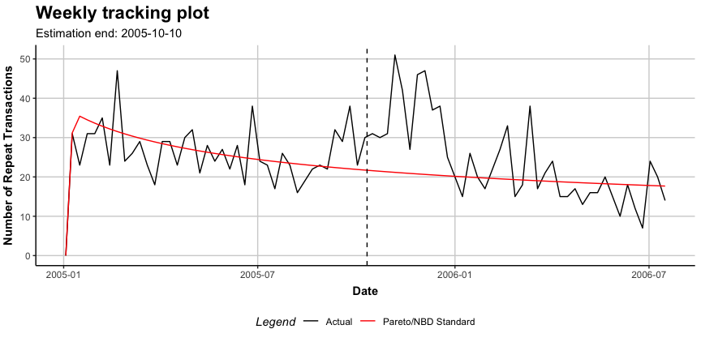

[](https://github.com/bachmannpatrick/CLVTools/actions)
[](https://github.com/bachmannpatrick/CLVTools/actions)
[](https://cran.r-project.org/package=CLVTools)
[](https://www.repostatus.org/#active)
[](https://cran.r-project.org/package=CLVTools)

<!-- README.md is generated from README.Rmd. Please edit that file -->

## The CLVTools Package

Today, customer lifetime value (CLV) is the central metric for valuing
customers. It describes the long-term economic value of customers and
gives managers an idea of how customers will evolve over time. To model
CLVs in continuous non-contractual business settings such as retailers,
probabilistic customer attrition models are the preferred choice in
literature and practice.

The R package `CLVTools` provides an efficient and easy to use
implementation framework for probabilistic customer attrition models in
non-contractual settings. Building up on the learnings of other
implementations, the package adopts S4 classes to allow constructing
rich and rather complex models that nevertheless still are easy to apply
for the end user. The framework is capable to accommodate a variety of
probabilistic customer attrition models for non-contractual settings in
continuous and discrete time.

Currently, CLVTools implements the following probabilistic models:

1.  Standard Pareto/NBD model (Schmittlein, Morrison & Colombo 1987)

2.  Pareto/NBD model with **time-invariant** contextual factors (Fader &
    Hardie 2007)

3.  Pareto/NBD model with **time-varying** contextual factors (Bachmann,
    Meierer & Näf 2021)

4.  Standard BG/NBD model (Fader, Hardie, & Lee 2005)

5.  BG/NBD model with **time-invariant** contextual factors (Fader &
    Hardie 2007)

6.  Standard Gamma/Gompertz/NBD (Bemmaor & Glady 2012)

7.  Gamma/Gompertz/NBD model with **time-invariant** contextual factors
    (Näf, Bachmann & Meierer 2020)

8.  Gamma/Gamma model to estimate customer spending (Colombo & Jiang
    1999; Fader, Hardie & Lee 2005; Fader & Hardie 2013)

In future versions of `CLVTools` the following models are added. See
[GitHub Issues](https://github.com/bachmannpatrick/CLVTools/projects)
for a time-line.

9.  Standard BG/BB model (Fader, Hardie, & Shang 2010)

In addition the framework features a system of layers between the
optimizer and the log-likelihood function to allow the flexible addition
of model extensions during the model fitting process. Currently these
layers include:

-   Correlation of the purchase and the attrition process

-   L2 regularization for parameters of contextual factors

-   Equality constraints between parameters of contextual factors for
    the purchase and the attrition process.

## Installation

Install the most recent **stable release from CRAN**:

    install.packages("CLVTools")

Install the **development version from GitHub** (using the `devtools`
package):

    devtools::install_github("bachmannpatrick/CLVTools", ref = "development")

To **compile the package from source**, please be advised that
`CLVTools` relies on an external C++ library called `GSL`. This library
has to be installed on your computer to be able to compile `CLVTools`
from source. Follow these 3 steps:

1.  Update to the latest version of R.

2.  Install the external dependency (`GSL`):

*For Linux:*  

<!-- -->

    apt-get update
    apt-get install libgsl0-dev

If you are using an R Docker container with Linux
(e.g. rocker/tidyverse), you can build up on these Docker images as
follows

    FROM rocker/tidyverse
    RUN apt-get update -qq && apt-get -y install \
        libgsl0-dev

Alternatively, follow the instruction in the section “Installing
Dependencies external to the R system” at
<https://ropenscilabs.github.io/r-docker-tutorial/03-install-packages.html>
to install `GSL` in a running Docker container with Linux.

*For Mac with Intel chip:* :

    brew install gsl

*For Mac with Apple Silicon:*  

1.  Download gsl-latest.tar.gz from <https://ftp.gnu.org/gnu/gsl/> and
    unzip it.

2.  Navigate to the unziped folder, e.g. `cd ~/Downloads/gsl-2.7.1`

3.  run the following commands line by line:

<!-- -->

    sudo make clean
    sudo chown -R $USER .
    ./configure && make
    make install

*For Windows:*  
First, install `RTools` through
<https://cran.r-project.org/bin/windows/Rtools/> (> v4.0). Next, use the
new `RTools` package manager to install the `GSL` library (see
<https://github.com/r-windows/docs/blob/master/rtools40.md#readme>) by
using `pacman` through the `RTools Bash`:

    pacman -S mingw-w64-{i686,x86_64}-gsl

3.  Install the development version from source:

<!-- -->

    devtools::install_github("bachmannpatrick/CLVTools", ref = "development")

## A Minimal Example

For detailed instructions and all available options and model variations
see the detailed
[walkthrough](https://www.clvtools.com/articles/CLVTools.html) and the
[manual](https://www.clvtools.com/reference/index.html).

Start by loading the package:

``` r
library("CLVTools")
```

As Input data `CLVTools` requires customers’ transaction history. Every
transaction record consists of a purchase date and customer ID.

``` r
data("apparelTrans")
apparelTrans
#>         Id       Date  Price
#>    1:    1 2005-01-03 230.30
#>    2:   10 2005-01-03  84.39
#>    3:   10 2005-02-25 131.07
#>    4:   10 2005-04-05  86.43
#>    5:  100 2005-01-03  11.49
#>   ---                       
#> 2349: 1221 2006-01-23  26.57
#> 2350: 1221 2006-03-09 129.82
#> 2351: 1221 2006-05-14  14.37
#> 2352: 1222 2005-01-03  44.77
#> 2353: 1222 2005-03-03  99.21
```

Before we estimate a model, we are required to initialize a data object
using the `clvdata()` command. The data object contains the prepared
transactional data and is later used as input for model fitting.
Additionally we specify options for the date and time units, estimation
duration and variable names (see
[Walkthrough](https://www.clvtools.com/articles/CLVTools.html) for
details). Make sure to store the generated object in a variable, e.g. in
our example `clv.apparel`.

``` r
clv.apparel <- clvdata(apparelTrans,  
                       date.format="ymd", 
                       time.unit = "week",
                       estimation.split = 40,
                       name.id = "Id",
                       name.date = "Date",
                       name.price = "Price")
```

Be aware that probabilistic models such as the ones implemented in
CLVTools are usually applied to specific customer cohorts. That means,
you analyze customer that have joined your company at the same time
(usually same day, week, month, or quarter). For more information on
cohort analysis, see also
[here](https://en.wikipedia.org/wiki/Cohort_analysis). Consequently, the
data apparelTrans in this example is not the full transaction records of
a fashion retailer, but rather only the customer cohort of 250 customers
purchasing for the first time at this business on the day of 2005-01-03.

As a first probabilistic latent attrition model we estimate the standard
Pareto/NBD model and therefore, use the command `pnbd()` to fit the
model and estimate model parameters. Other models such as the BG/NBD
model (`bgnbd()`) and the GGomp/NBD (`ggomnbd()`) are also available.

``` r
est.pnbd <- pnbd(clv.data = clv.apparel)
#> Starting estimation...
#> Estimation finished!
est.pnbd
#> Pareto/NBD Standard Model
#> 
#> Call:
#> pnbd(clv.data = clv.apparel)
#> 
#> Coefficients:
#>       r    alpha        s     beta  
#>  0.7866   5.3349   0.3570  11.6152  
#> KKT1: TRUE 
#> KKT2: TRUE 
#> 
#> Used Options:
#> Correlation:     FALSE
```

You can always use `summary()` to get details on CLVTools object (also
before they are estimated):

``` r
#Full detailed summary of the parameter estimates
summary(est.pnbd)
#> Pareto/NBD Standard  Model 
#> 
#> Call:
#> pnbd(clv.data = clv.apparel)
#> 
#> Fitting period:                               
#> Estimation start  2005-01-03   
#> Estimation end    2005-10-10   
#> Estimation length 40.0000 Weeks
#> 
#> Coefficients:
#>       Estimate Std. Error z-val Pr(>|z|)    
#> r       0.7866     0.1324 5.942 2.81e-09 ***
#> alpha   5.3349     0.9027 5.910 3.42e-09 ***
#> s       0.3570     0.1838 1.943   0.0521 .  
#> beta   11.6152    10.6598 1.090   0.2759    
#> ---
#> Signif. codes:  0 '***' 0.001 '**' 0.01 '*' 0.05 '.' 0.1 ' ' 1
#> 
#> Optimization info:                 
#> LL     -2879.4699
#> AIC    5766.9399 
#> BIC    5781.0257 
#> KKT 1  TRUE      
#> KKT 2  TRUE      
#> fevals 23.0000   
#> Method L-BFGS-B  
#> 
#> Used Options:                 
#> Correlation FALSE
```

Once the model parameters are estimated, we are able to predict future
customer behavior on an individual level. To do so, we use `predict()`
on the object with the estimated parameters (i.e. `est.pnbd`). In
general, probabilistic customer attrition model predict three expected
characteristics for every customer:

-   “conditional expected transactions” (CET), which is the number of
    transactions to expect form a customer during the prediction period,
-   “probability of a customer being alive” (PAlive) at the end of the
    estimation period and
-   “discounted expected residual transactions” (DERT) for every
    customer, which is the total number of transactions for the residual
    lifetime of a customer discounted to the end of the estimation
    period.

If spending information was provided when initializing the
clvdata-object, also “customer lifetime value” (CLV) is predicted.

``` r
results <- predict(est.pnbd)
#> Predicting from 2005-10-11 until (incl.) 2006-07-16 (39.86 Weeks).
#> Estimating gg model to predict spending...
#> Starting estimation...
#> Estimation finished!
print(results)
#>        Id period.first period.last period.length actual.x actual.total.spending
#>   1:    1   2005-10-11  2006-07-16      39.85714        0                  0.00
#>   2:   10   2005-10-11  2006-07-16      39.85714        0                  0.00
#>   3:  100   2005-10-11  2006-07-16      39.85714       23                737.53
#>   4: 1000   2005-10-11  2006-07-16      39.85714       23               1069.91
#>   5: 1001   2005-10-11  2006-07-16      39.85714       11                364.00
#>  ---                                                                           
#> 246: 1219   2005-10-11  2006-07-16      39.85714       14                413.76
#> 247:  122   2005-10-11  2006-07-16      39.85714        0                  0.00
#> 248: 1220   2005-10-11  2006-07-16      39.85714        0                  0.00
#> 249: 1221   2005-10-11  2006-07-16      39.85714        9                302.65
#> 250: 1222   2005-10-11  2006-07-16      39.85714        0                  0.00
#>         PAlive        CET       DERT predicted.mean.spending predicted.CLV
#>   1: 0.3571791  0.2212506 0.05848859                39.95483      2.336902
#>   2: 0.4225636  0.9272819 0.24513121                55.23031     13.538672
#>   3: 0.9155479 13.5448630 3.58064629                43.57390    156.022721
#>   4: 0.9967780 13.1766970 3.48331993                41.60921    144.938180
#>   5: 0.5098134  3.5275846 0.93253307                45.58153     42.506281
#>  ---                                                                      
#> 246: 0.9579241  3.6108002 0.95453149                33.58728     32.060115
#> 247: 0.3571791  0.2212506 0.05848859                39.95483      2.336902
#> 248: 0.3571791  0.2212506 0.05848859                39.95483      2.336902
#> 249: 0.9434302  4.2991096 1.13648922                34.28958     38.969738
#> 250: 0.4136156  0.5819279 0.15383529                47.35500      7.284870
```

`clvdata` objects may be plotted using the `plot()` command. Similar to
`summary()`, the output of `plot()` adapts to the current modeling step.

``` r
plot(est.pnbd)
#> Plotting from 2005-01-03 until 2006-07-16.
```



## Contributions

Feedback and contributions to this package are welcome! Please use
[GitHub Issues](https://github.com/bachmannpatrick/CLVTools/issues) for
filing bug reports. Provide your contributions in the form of [Pull
Requests](https://help.github.com/articles/about-pull-requests/). See
also [these general
guidelines](https://guides.github.com/activities/contributing-to-open-source/#contributing)
to contribute to Open Source projects on GitHub.
